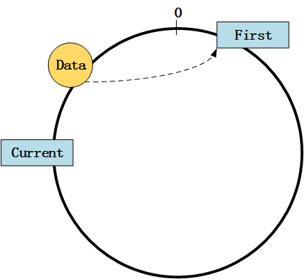
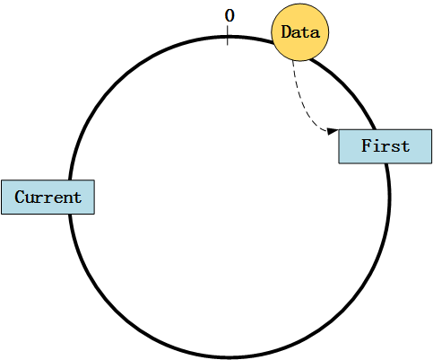
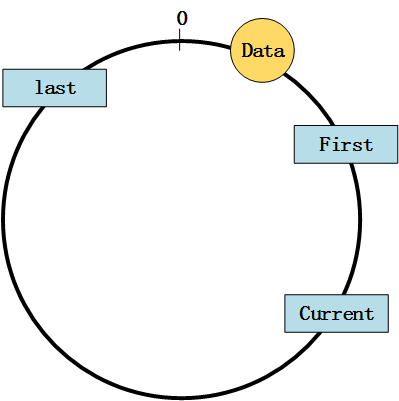
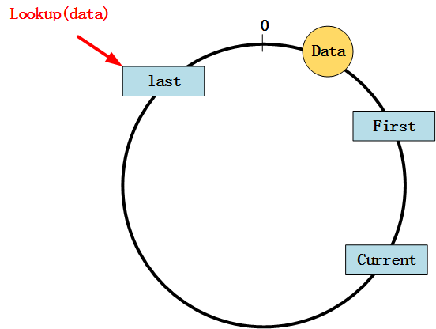
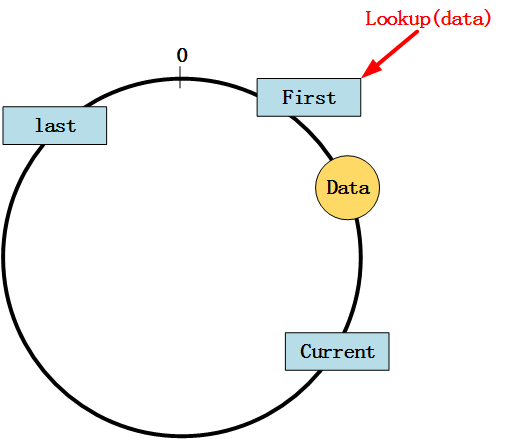

# 一致性哈希和Chord环
## 一. 数据结构的选择
### 1. 哈希环
哈希环的数字空间是32位, 需要按照key顺序存储, STL的`map`是不错的选择. 同时`map`基于红黑树, 具有很好的查询效率. 但是`map`本身不是环形结构, 要模拟出哈希环就需要在遇到边界时做特殊处理, 该问题在查找数据时尤为显著.

### 2. 节点上保存的数据
节点上存储数据使用STL的`multimap`, 与`map`不同的是它允许存在多个相同的key. 哈希环上的节点的位置必须唯一, 但数据无此要求, 如果两个数据的哈希值相同, 它们还是会被存储在一个节点上而不会产生歧义. 另外, `multimap`的红黑树结构能保证高效查找, 所以保存数据应选择`multimap`.

### 3. 节点的路由表
在Chord环上查找数据时对路由表的操作按照"**由远及近**"原则. 不是倒序遍历路由表, 而且路由表必须存满32项, 这意味着如果遇到边界就要回绕. 路由表中距离当前节点最远的节点不会越过边界, 也就是说最远只能是边界上的节点, 不会回绕. 如果使用`multimap`, 那么使用`reserse_iterator`就能按照key从大到小遍历路由表, 只需将节点位置设为key, 至于value则无关紧要. 这么一来, 实则无需按照"第`i`项表示`hash(node) + 2^(i-1)`处的数据所属节点的位置"之规定. 如果路由表真的这么设置, 那么"**由远及近**"的查找原则很不易实现.

## 二. 数据查找的特殊情况
### 1. 当前查询节点(Current)没有后继（或者说后继回绕到第一个节点）
此时，数据(Data)、头节点(First)、尾节点(Last)和当前查询节点(Current)的相对位置有以下三种：

#### (1) case 1

查询结果为`First`.

#### (2) case 2

查询结果为`First`.

#### (3) case 3

跳转到`First`继续查询.

### 2. 数据(Data)位于查询死角
距离`Current`最远的节点是`Last`, 从`Current`按顺时针方向旋转到`Last`范围内的节点中, 无一满足`Hash(Node) <= Hash(Data)`, 所以无法通过`Current`的路由表找到`Data`. 此时需要确定新的查询起点. 有以下两种情况：

#### (1) case 1

此时从`Last`开始查找, 对应于上一小节中的**case 2**, 如下图所示:

如果在`Last`上执行`Lookup(Data)`查询失败, 说明遇到了下面的情形：

#### (2) case 2

此时从`First`开始查找, 对应于上一小节中的**case 3**, 如下图所示:

之后一定可以找到`Data`.

## 三. 实现的功能
- [x] 物理节点和虚拟节点的添加和删除，由此引发Chord环上数据的重新分派
- [x] 通过节点的路由表实现数据的增删改查
- [x] 打印每个物理节点上保存的数据

